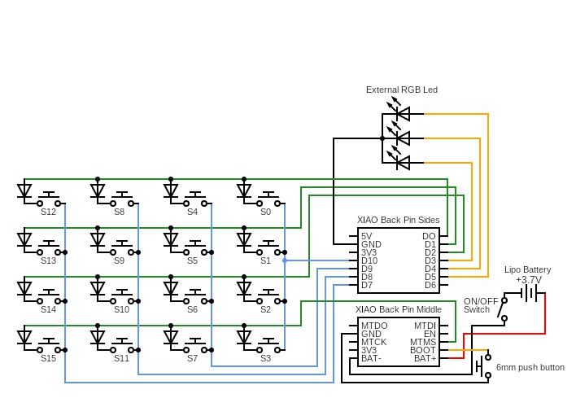
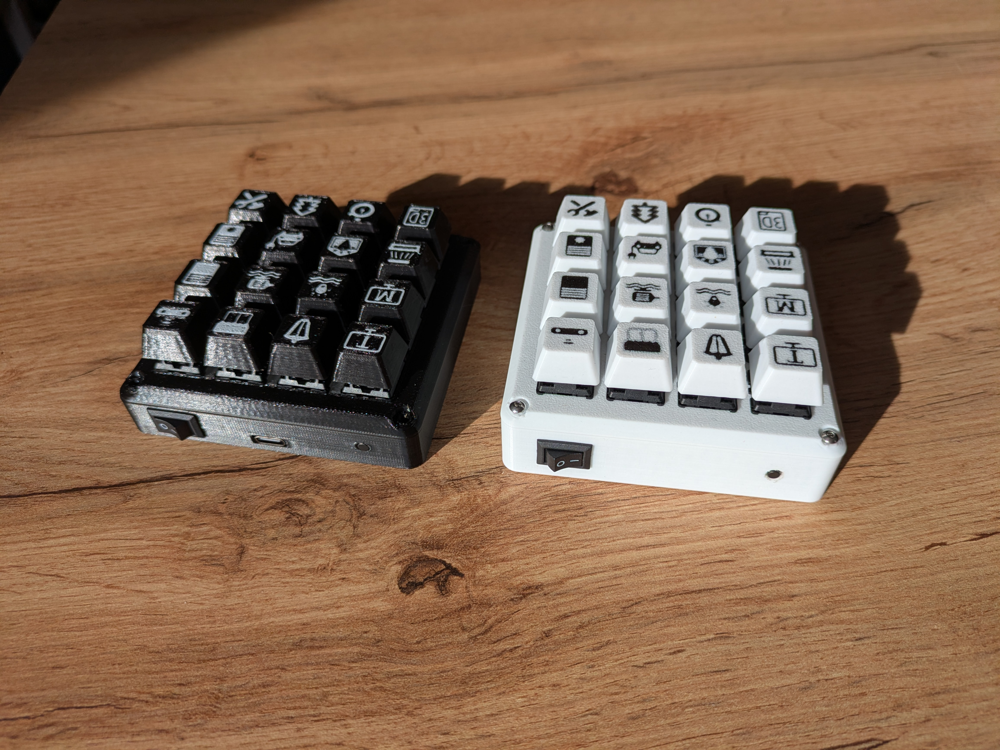
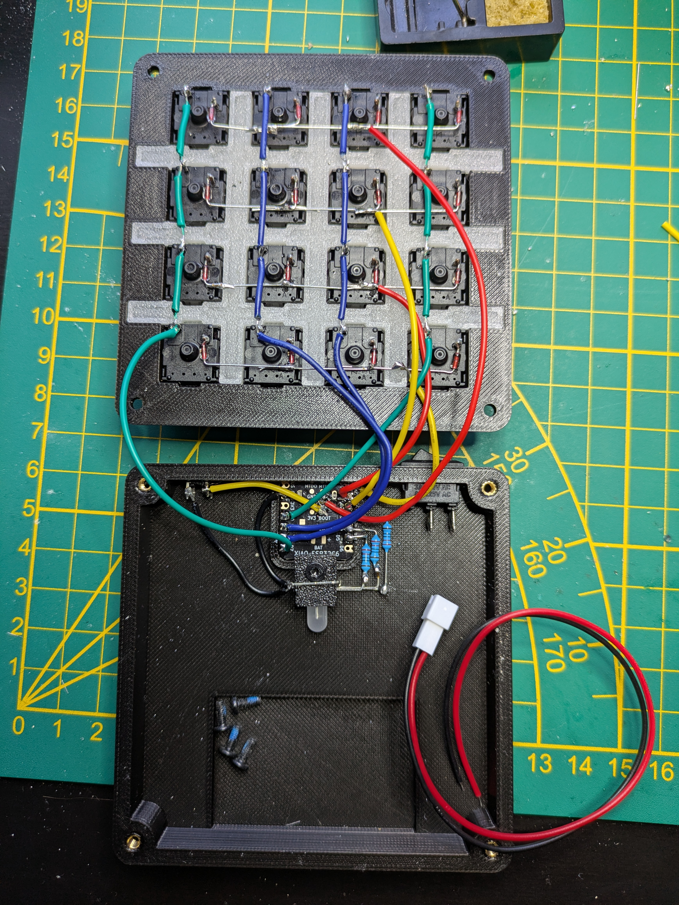

# 🧠 Zigbee Macropad (ESP32-C6)

A compact **16-key Zigbee macropad** powered by the an **ESP32-C6**, designed for integration with **Home Assistant (ZIGBEE2MQTT)**.  
It provides tactile mechanical key input, configurable LED feedback, and a fully 3D-printed case.
It gives 3 sorts of inputs, single click, double clicks and long click to add into any automation to control device remotely.

---

## ⚙️ Hardware

| Component | Description |
|------------|-------------|
| **MCU** | Seeed Studio XIAO ESP32C6 |
| **Switches** | 16 x Cherry MX Red (linear) |
| **Battery** | 1 x 3.7V 1000mAh Lipo 603048 |
| **Button** | 6 mm tactile push button (BOOT / Reset) |
| **Power switch** | 13 mm by 8.5 mm on/off slide switch |
| **Magnets** | 4 x 10 mm × 2 mm neodymium discs |
| **Threaded inserts** | 4 x M2.5 heat-set brass inserts |
| **Screws** | 4 x M2.5 × 5 mm machine screws |
| **Didodes**| 16 x 1N4148 Small Signal Fast Switching Diodes |
| **External RGB Led**| 1 x 4 pins 5mm RGB Led Common Cathode |
| **220 ohm resistor**| 3 x 220 ohm resistor |
| **Case** | 3D-printed PLA enclosure (about 79g with cap switches and supports) |
| **Switches cap**| 16 x 3D-printed in PLA less than 18g total |


---

## 🧩 3D-Printed Parts

Designed and customized in **Tinkercad**, printed with **Centauri Carbon and transparent PLA**.  
Printed at 0.2 mm layer height, 15–20% infill, no supports required.

Files available on Github or in Printables [here](https://www.printables.com/model/1496778-zigbee-macropad-16-buttons-esp32c6) or Thingiverse [there](https://www.thingiverse.com/thing:7215442).

### 🔗 Remixed Models
- [16 Keys Macropad](https://www.printables.com/model/140766-16-keys-macropad)  
- [Simple Cherry MX Keycap](https://www.printables.com/model/118708-simple-cherry-mx-keycap)

---

## 💻 Code

Development began in **Arduino IDE**, later migrated to **VS Code with ESP-IDF v5.3.4** for Zigbee and multitasking support.

### 🧠 Software Stack
- **Framework:** ESP-IDF v5.3.4  
- **Zigbee SDK:** [Espressif ESP-Zigbee-SDK](https://github.com/espressif/esp-zigbee-sdk)  
- **Zigbee Role:** Router / End Device  
- **Endpoint Type:** Custom Endpoint and clusters

### 🔧 Functionality
- 16 GPIO-connected keys with **single**, **double**, and **long press** detection
- **LED feedback** color for each type of press  
- **LED feedback** brightness controlled via Zigbee “brightness” attribute  
- **BOOT button** triggers Zigbee factory reset and new pairing mode  
- **ON/OFF switch** physical button to turn everything off and recharge the batteries
- **Blinking red LED** indicates pairing state  
- **Debounce and ISR-driven** button logic for reliability  
- **Deep sleep** after 20 sec to save battery time  

---

## 🗺️ Circuit Schematic
[Link to circuit] (https://www.circuit-diagram.org/editor/c/4865aa39fb9b4097a776ca335299ee0a)


---

## 💰 Price Breakdown
Calculated from **unit price × quantity used**:

| Item | Pack Price | Qty Used | Unit Cost | Cost Used |
|------|------------|----------|-----------|-----------|
| XIAO Esp32C6 | 8.04 € / 1 | 1 | 8.04 € | **8.04 €** |
| Mechanical Switches | 8.18 € / 20 | 16 | 0.41 € | **6.54 €** |
| Diodes 1N4148 | 1.20 € / 100 | 16 | 0.01 € | **0.19 €** |
| Magnets | 4.99 € / 50 | 4 | 0.10 € | **0.40 €** |
| M2.5 Inserts | 10.79 € / 600 | 9 | 0.018 € | **0.16 €** |
| Transparent PLA | 16.00 € / 1 kg | 100 g | 1.60 € | **1.60 €** |
| 6mm Push Button | 2.23 € / 50 | 1 | 0.045 € | **0.04 €** |
| ON/OFF Switch | 1.41 € / 5 | 1 | 0.28 € | **0.28 €** |
| 3.7V 1000mAh 603048 Lipo Battery  | 9.49 € / 3 | 1 | 3.16 € | **3.16 €** |
| External 5mm RGB Led Common Cathode | 1.29 € / 50 | 1 | 0.03 € | ** 0.03 €** |
| 220ohm resistore | 0,93€ / 100 | 3 | 0.028 € | ** 0.03 €** |
   
### **➡️ Total Cost per Macropad: 20.47 €**

---

## ⚠️ Note about the ESP32-C6 board

Using the Seeed Studio XIAO ESP32C6 is a breethe. 

The documentation is excellent.
The chip already contains a BMS so you can plug the battery directly in and charge it with USB-C

---

## 🧰 Build Instructions

### 🪛 1. Print and Prepare the Case
- Print all parts. Only the remix part is present in github, everything else can be found on printables.
- Verify that magnets, switches, and PCB fit snugly before final assembly.
- Insert **M2.5 heat-set inserts** into the designated mounting points using a soldering iron at ~200 °C.

### ⚡ 2. Mount the Components
- **Cherry MX switches**: press-fit into the 16-slot plate, solder to perfboard or PCB or with simple wires.
- **XIAO ESP32C6**: simply clip in place with any fixation. You might need to push a bit hard.
- **6 mm BOOT button**: mount to a small hole on the side (for Zigbee reset). Add some glue from glue gun.
- **Power switch**: connect inline with battery’s.
- **Battery holder**: Press fit battery inside. The EBL battery have a builtin BMS so I glue them in their slot with the micro usb accessible outside.
- **Magnets**: press-fit into the lid and base for a secure snap fit. You can add super glue to make sure they don't move.

### 🔋 3. Wiring Overview
| Connection | Description |
|-------------|-------------|
| **GPIO 0(D0),1(D1),2(D2),4(MTMS) and 18(D10),19(D9),20(D8),17(D7)** | 0,1,2,4 are for Rows, 18,19,20,17 are for Columns. Follow the wiring diagram. Connect 4 wires to columns and to one side of every switch. Connect all diodes to the other side of the switch. Make sure the black marker is connected to the switch and the other end is connected to the 3 other diodes on the same row. |
| **GPIO 9(BOOT)** | BOOT / Reset button. Connect to one side of the 6mm button and the other to GND. |
| **GPIO 21(D3),22(D4),23(D5)** | RGB Led is connected to 220 ohm resistor and to ground. The longest pin is ground. The side with a single pin it's R that goes into D5, then D4 for G, then D3 for B |
| **Battery pack** | Bat+ and Bat- on the ESP32 with bat + in line with the On/Off switch. |
| **On/Off switch** | Inline with battery lead. |

### 🔧 4. Flash the Firmware
1. Install **ESP-IDF v5.3.4** (or newer).  
2. Clone or copy the project to your workspace.  
3. Build and flash:
   ```bash
   idf.py set-target esp32c6
   idf.py build
   idf.py flash monitor
The device will start blinking red to indicate Zigbee pairing mode.

---

## 🔗 Pair with Home Assistant

Add macropad.mjs file to config/zigbee2mqtt/external_converters (if folder does not exist create it).
Then reboot Zigbee2MQTT in Settings/Add-ons/Zigbee2MQTT/Info and press Restart (takes 30 seconds)
In Home Assistant, open Settings → Devices & Services → Zigbee2MQTT → Permit join.
Test button clicks (single, double, hold) — LED flashes will reflect the button type.
You can now create an automation based on the button clicks.

If in the Zigbee2MQTT interface/Devices/deviceName/Exposes there is not 3 attributes (Action, Brightness, Linkquality) there is an issue.
You may have to change the cluster name to fit your home assistant. It is used 4 times in my file and called "manuSpecificAssaDoorLock".
This name is automatically attributed by home assistant and cannot be changed.
To find your cluster name, simply check the logs in Zigbee2MQTT. I prefer checking them in the add-on directly since there is more information.
Add-on logs accessible in Settings/Add-ons/Zigbee2MQTT/Log

---

## ✨ Features Summary

🔘 16 mechanical switches with multiple click detection
🔋💤 Deep Sleep feature turning on after 20 sec to save battery
💡 LED feedback brightness linked to Zigbee brightness setting
🔄 BOOT button triggers factory reset and re-pairing
🔴 Blinking red LED during pairing
🧱 Modular, 3D-printed enclosure with magnets and inserts
🪫 Battery powered with on/off switch

---

## 🧾 License

This project is released under the MIT License.
Remixed 3D models remain under their respective creator licenses (see linked Printables pages).

---

## 📸 Gallery




